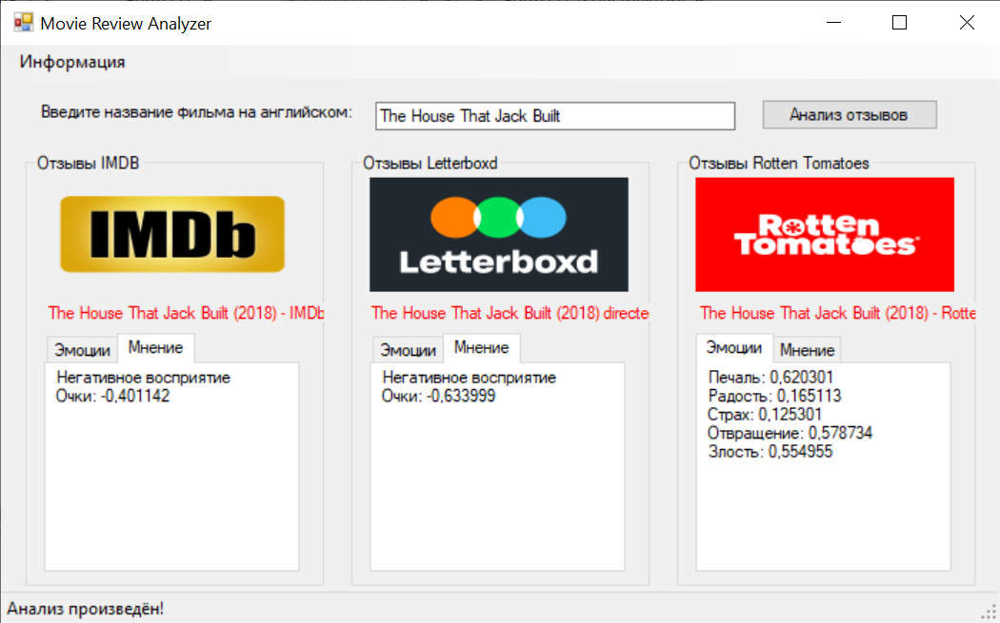
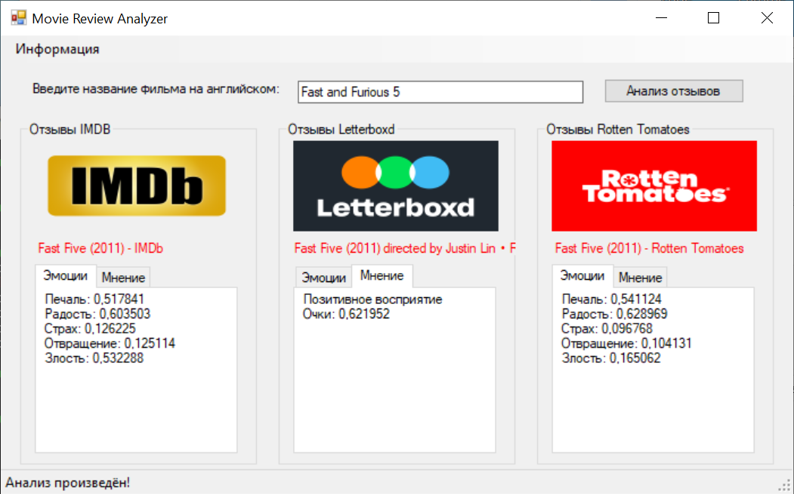

# Интеллектуальный анализ зрительских отзывов о фильмах на англоязычных ресурсах

## Технологии
- IBM.Watson.NaturalLanguageUnderstanding.v1.4.6.0 (интеллектуальный анализ сентимента и эмоций текста)
- GoogleCustomSearchEngine.4.0.4 (получение ссылок на ресурсы по названию фильма)
- Windows Forms (фронтенд)

## Скриншоты

